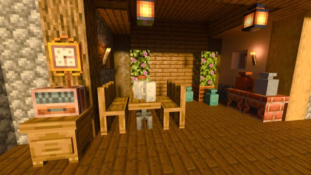

# Який мод використовується Компота?
1. [Модифікація Simple Arsenal](#модифікація-simple-arsenal)
2. [DecoDrop](#decodrop)
3. [Vanilla Hammers](#vanilla-hammers)
4. [Atlas Client](#atlas-client)
5. [Phase Blocks](#phase-blocks)  
***
> [!Note]
> Всі моди створюють гармонійну екосистему для Atlas Client.
>   
> Вони ідеально доповнюють один одного: **візуальні покращення працюють у тандемі з новими ігровими механіками, а зручні інструменти спрощують взаємодію з іншими доповненнями**.
>   
> Особливу увагу приділено оптимізації - моди не конфліктують між собою та демонструють стабільну роботу навіть за спільної установки. Для досягнення кращої продуктивності рекомендується використовувати не більше 7-20 мод одночасно, особливо на мобільних пристроях.
>   
***
# Atlas Client
|  |
|---|
|  |
|  |
|  |
***
> [!Warning]
> **Не оновлювайте Minecraft Bedrock Edition**.
>   
> *Atlas Client підтримує крайню версію Minecraft Bedrock Edition 1.21.72*.
>  
***
|  |
|---|
|  |
|  |
***
## DecoDrop

***
